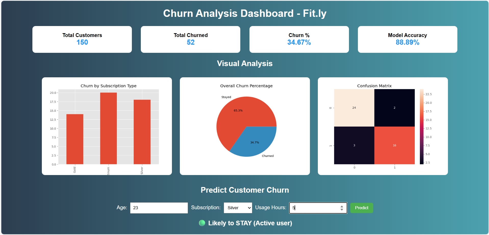
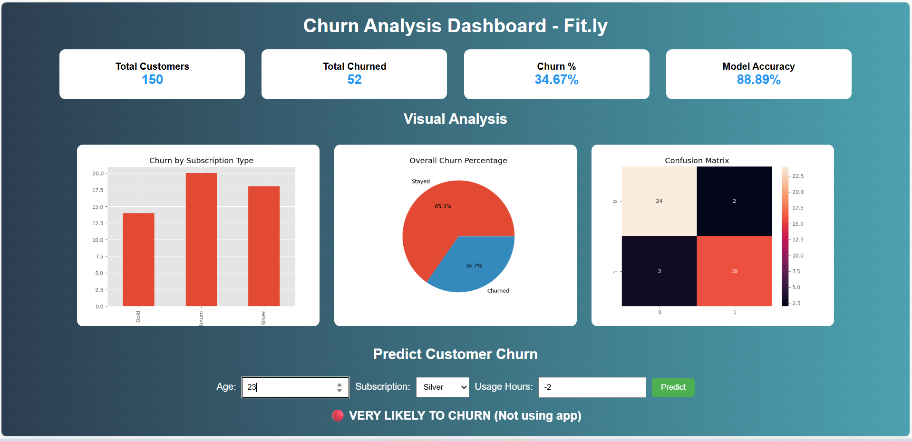

# 🏋️‍♂️ Fit.ly Customer Churn Analysis Dashboard

A full-stack data analytics web application that analyzes customer churn for a fitness app and predicts whether a customer is likely to stay or churn using machine learning.

This project integrates Python, Machine Learning, Flask, HTML, CSS, and Data Visualization into an interactive dashboard.

---

## 📌 Project Overview

Customer churn is a major challenge for subscription-based platforms. This project analyzes customer behavior and predicts churn using historical data.

The dashboard provides:

- ✅ Key churn metrics
- ✅ Visual analytics charts
- ✅ Machine learning churn prediction
- ✅ Interactive user input form

---

## 🚀 Features

### 📊 Data Analytics Dashboard

- **Total Customers**
- **Total Churned Users**
- **Churn Percentage**
- **Machine Learning Model Accuracy**

### 📈 Visualizations

- Churn by Subscription Type (Bar Chart)
- Overall Churn Distribution (Pie Chart)
- Confusion Matrix Heatmap

### 🤖 Machine Learning Prediction

Predicts whether a customer will **STAY** or **CHURN** based on:

- Age
- Subscription Plan
- App Usage Hours

### 🌐 Web Interface

- Built with Flask, HTML, and CSS
- Clean and responsive UI

---

## 🖥️ Screenshots

### Customer Likely to Stay


### Customer Likely to Churn


---

## 🛠️ Tech Stack

| Category | Technologies |
|----------|-------------|
| **Programming & ML** | Python, Pandas, NumPy, Scikit-learn |
| **Web Framework** | Flask |
| **Frontend** | HTML5, CSS3 |
| **Visualization** | Matplotlib, Seaborn |

---

## 📂 Project Structure

```
Churn-Analysis-at-Fit.ly/
│
├── app.py                 # Main Flask application
├── requirements.txt       # Python dependencies
├── static/               
│   ├── style.css         # Custom styles
│   ├── bar.png           # Bar chart visualization
│   ├── pie.png           # Pie chart visualization
│   └── confusion.png     # Confusion matrix heatmap
│
├── templates/
│   └── index.html        # Main dashboard template
│
└── README.md             # Project documentation
```

---

## ⚙️ How to Run the Project

### 1️⃣ Clone the Repository

```bash
git clone https://github.com/YogeshK34/Churn-Analysis-at-Fit.ly.git
cd Churn-Analysis-at-Fit.ly
```

### 2️⃣ Install Dependencies

```bash
pip install -r requirements.txt
```

### 3️⃣ Run the Flask App

```bash
python app.py
```

### 4️⃣ Open in Browser

Navigate to:
```
http://127.0.0.1:5000/
```

---

## 🔗 Live Demo

Coming Soon...

---

## 📄 License

This project is open source and available for educational purposes.

---

## 👨‍💻 Author

**YogeshK34**

Feel free to reach out for any questions or suggestions!